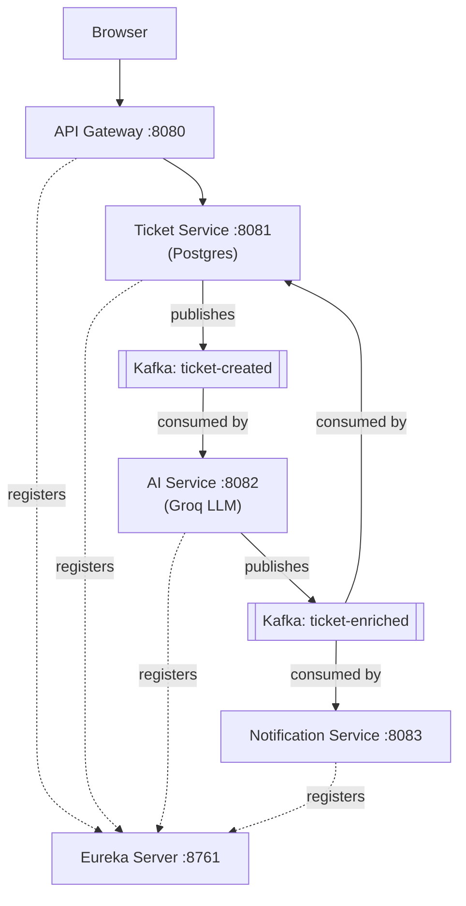

# Smart Helpdesk

An AI-powered support ticket system built with Spring Boot microservices, Kafka event streaming, and Spring AI. Tickets are automatically classified, sentiment-analyzed, and given a suggested reply by an LLM the moment they're created — with the result routed back to the ticket record and out to a notification service, entirely asynchronously.

## Architecture



**Flow:** a ticket is created → `ticket-service` saves it and publishes `ticket-created` → `ai-service` consumes it, calls Groq (via Spring AI) to classify category/sentiment and draft a reply, then publishes `ticket-enriched` → both `ticket-service` (updates the DB row) and `notification-service` (sends a notification) consume that event independently, in parallel — neither one knows the other exists.

## Tech Stack

- **Backend:** Java 21, Spring Boot 4.1, Spring Cloud 2025.1
- **Service Discovery:** Netflix Eureka
- **API Gateway:** Spring Cloud Gateway (MVC)
- **Messaging:** Apache Kafka
- **Database:** PostgreSQL
- **AI:** Spring AI 2.0 + Groq (OpenAI-compatible API)
- **Frontend:** React (Vite)
- **Containerization:** Docker, Docker Compose

## Services

| Service | Port | Responsibility |
|---|---|---|
| `eureka-server` | 8761 | Service registry |
| `api-gateway` | 8080 | Single entry point, routes to backend services |
| `ticket-service` | 8081 | Ticket CRUD, Postgres persistence, publishes/consumes ticket events |
| `ai_service` | 8082 | Consumes new tickets, classifies via Groq, publishes enrichment |
| `notification-service` | 8083 | Consumes enrichment events, sends notifications |
| `frontend` | 3000 | React UI |

## Running the project

### Option A: Docker Compose (recommended)

1. Create a `.env` file in the project root:
   ```
   GROQ_API_KEY=your_groq_api_key_here
   ```
2. Run:
   ```bash
   docker-compose up --build
   ```
3. Open `http://localhost:3000` for the UI, or `http://localhost:8761` for the Eureka dashboard.

To rebuild a single service after a code change (no need to restart everything):
```bash
docker-compose up --build <service-name>
```

### Option B: Running locally (IntelliJ)

Start in this order:
1. Postgres and Kafka (`docker-compose up postgres kafka`, or your own local install)
2. `eureka-server`
3. `ticket-service`, `ai_service`, `notification-service` (any order, after Eureka is up)
4. `api-gateway`
5. `cd frontend && npm run dev`

`ai_service` requires `GROQ_API_KEY` set as an environment variable in its run configuration.

## API Example

```bash
curl -X POST http://localhost:8080/ticket-service/api/tickets \
  -H "Content-Type: application/json" \
  -d '{
    "title": "Cannot reset password",
    "description": "The reset link in the email is not working",
    "createdBy": "user@example.com"
  }'
```

Within a few seconds, the ticket's `category`, `sentiment`, and `suggestedReply` fields populate automatically.

## Known Limitations / Next Steps

- **No authentication or authorization** — any client can create/read/delete any ticket. Would add JWT-based auth validated at the gateway, with `createdBy` derived from the authenticated user rather than free text.
- **No Postgres/Kafka health-check gating in Compose** — services start immediately after their dependencies' containers start, not after they're actually ready. Works in practice due to Spring's retry behavior, but a `healthcheck` + `depends_on: condition: service_healthy` would be more correct.
- **No automated tests.**
- **AI category parsing** (`TicketCategory.valueOf(...)`) will throw if the LLM ever returns a value outside the five defined categories — no fallback handling yet.

## Architecture Decisions Worth Knowing

- **Each service keeps its own copy of shared event classes** (e.g. `TicketEnrichedEvent` exists separately in `ai_service`, `ticket-service`, and `notification-service`) rather than a shared library — deliberate, to keep services independently deployable.
- **Kafka consumer groups:** `ticket-service` and `notification-service` both subscribe to `ticket-enriched` but with different consumer group IDs, so each gets its own independent copy of every event — this is what lets one event trigger two unrelated side effects (a DB update and a notification) without either service knowing the other exists.